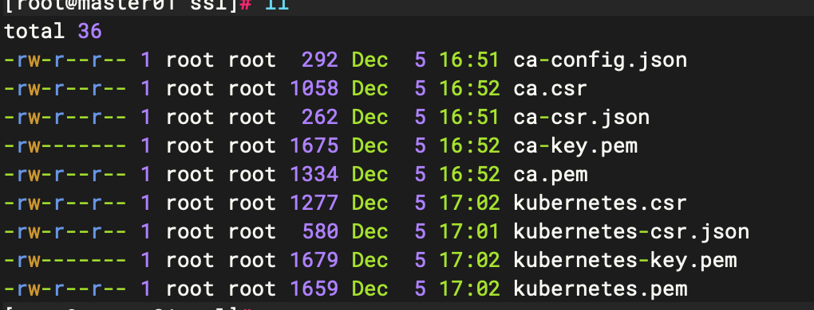
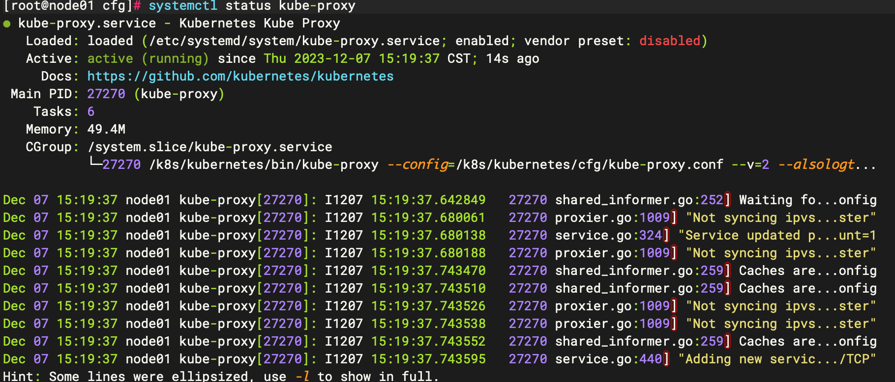
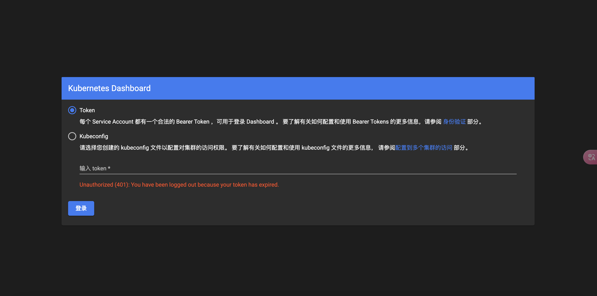
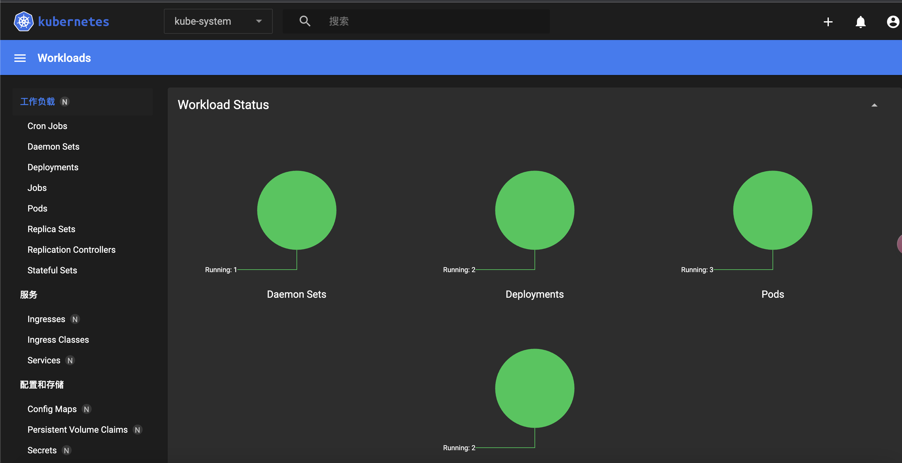

# 搭建kubenetes v1.25.16测试集群

## 认识kubernetes

Kubernetes将一系列的主机看做是一个受管理的海量资源，这些海量资源组成了一个能够方便进行扩展的操作系统。而在Kubernetes中运行着的容器则可以视为是这个操作系统中运行的“进程”，通过Kubernetes这一中央协调器，解决了基于容器应用程序的调度、伸缩、访问负载均衡以及整个系统的管理和监控的问题。

### kubernetes应用管理模型


**Pod是Kubernetes中的最小调度资源。**Pod中会包含一组容器，它们一起工作，并且对外提供一个（或者一组）功能。对于这组容器而言它们共享相同的网络和存储资源，因此它们之间可以直接通过本地网络（127.0.0.1）进行访问。当Pod被创建时，调度器（kube-schedule）会从集群中找到满足条件的节点运行它。

**启动多个实例（副本），则需要使用到控制器（Controller）**，用户可以在Controller定义Pod的调度规则、运行的副本数量以及升级策略等等信息，当某些Pod发生故障之后，Controller会尝试自动修复，直到Pod的运行状态满足Controller中定义的预期状态为止。

Kubernetes中提供了多种Controller的实现，包括：

- Deployment（无状态应用）
- StatefulSet（有状态应用）
- Daemonset（守护模式）

**集群内的应用如何通信**，Service在Kubernetes集群内扮演了服务发现和负载均衡的作用。在Kubernetes下部署的Pod实例都会包含一组描述自身信息的label，而创建Service，可以声明一个Selector（标签选择器）。Service通过Selector，找到匹配标签规则的Pod实例，并将对Service的请求转发到代理的Pod中。Service创建完成后，集群内的应用就**可以通过使用Service的名称作为DNS域名进行相互访问。**

**外部用户如何访问部署在集群内的应用，**Kubernetes中定义了单独的资源Ingress（入口）。Ingress是一个工作在7层的负载均衡器，其负责代理外部进入集群内的请求，并将流量转发到对应的服务中。

**Kubernetes定义了Namespace（命名空间）对资源进行隔离。**同一个Kubernetes集群其可能被多个组织使用，为了隔离这些不同组织创建的应用程序。

### kuberenetes架构模型


**Master组件**

Matser组件提供了集群层面的管理功能，它们负责响应用户请求并且对集群资源进行统一的调度和管理。

- kube-apiserver：负责对外暴露Kubernetes API；
- etcd：用于存储Kubernetes集群的所有数据；
- kube-scheduler: 负责为新创建的Pod选择可供其运行的节点；
- kube-controller-manager： 包含Node Controller，Deployment Controller，Endpoint Controller等等，通过与apiserver交互使相应的资源达到预期状态。

**Node组件**

Node组件会运行在集群的所有节点上，它们负责管理和维护节点中运行的Pod，为Kubernetes集群提供运行时环境。

- kubelet：负责维护和管理节点上Pod的运行状态；
- kube-proxy：负责维护主机上的网络规则以及转发。
- Container Runtime：如Docker,rkt,runc等提供容器运行时环境。

## 搭建（二进制）

### 搭建准备

***master节点***

***2c2g centos7.6 50GB***

***node节点***

***2c4g centos7.6 50GB***

### 操作系统初始化

```shell
#关闭防火墙
systemctl stop firewalld
systemctl disable firewalld

#关闭SE安全中心
setenforce 0
sed -i 's/enforcing/disabled/' /etc/selinux/config 

#关闭swap 
swapoff -a                                           #临时关闭
sed -ri 's/.*swap.*/#&/' /etc/fstab                  #永久关闭，&符号代表前面匹配的所有

#根据规划设置主机名
hostnamectl set-hostname master01 
hostnamectl set-hostname node01 
hostnamectl set-hostname node02

#在master添加hosts
cat >> /etc/hosts << EOF 
192.168.142.10 master01 
192.168.142.20 node01 
192.168.142.30 node02 
EOF

# 加载 br_netfilter 模块
modprobe br_netfilter
# 验证模块是否加载成功： 
lsmod |grep br_netfilter
# 修改内核参数
cat > /etc/sysctl.d/k8s.conf <<EOF
net.bridge.bridge-nf-call-ip6tables = 1
net.bridge.bridge-nf-call-iptables = 1
net.ipv4.ip_forward = 1 
EOF
#使刚才修改的内核参数生效 
sysctl -p /etc/sysctl.d/k8s.conf


#时间同步，可以加入计划任务定时执行减小偏差
yum install ntpdate -y
ntpdate time.windows.com

#配置免密登陆
ssh-keygen -t rsa
ssh-copy-id -i /root/.ssh/id_rsa.pub node01

```

### 部署etcd集群

简单 安装配置简单，而且提供了HTTP API进行交互，使用也很简单

安全 支持SSL证书验证

快速 单实例支持每秒2k+读操作

可靠 采用raft算法，实现分布式系统数据的可用性和一致性

> 由于etcd的leader选举机制，要求至少为3台或以上的奇数台。

#### 配置工作目录

```shell
mkdir -p /etc/etcd/ssl
```

#### 准备签发证书环境

CFSSL是CloudFlare 公司开源的一款PKI/TLS 工具。CFSSL包含一个命令行工具和一个用于签名、验证和捆绑TLS证书的HTTP API服务。使用Go语言编写。
CFSSL使用配置文件生成证书，因此自签之前，需要生成它识别的json格式的配置文件，CFSSL提供了方便的命令行生成配置文件。

#### 下载证书制作工具

cfssl：证书签发的工具命令
cfssljson：将cfssl生成的证书(json格式)变为文件承载式证书
cfssl-certinfo：验证证书的信息
cfssl-certinfo -cert <证书名称>：查看证书信息

```shell
wget https://pkg.cfssl.org/R1.2/cfssl_linux-amd64 -o /usr/local/bin/cfssl
wget https://pkg.cfssl.org/R1.2/cfssljson_linux-amd64 -o /usr/local/bin/cfssljson
wget https://pkg.cfssl.org/R1.2/cfssl-certinfo_linux-amd64 -o /usr/local/bin/cfssl-certinfo
chmod +x cfssl*
```

##### github地址

```shell
https://github.com/cloudflare/cfssl/releases/tag/v1.6.4
```

#### 配置生产证书文件脚本

```shell
vim etcd-cert.sh
```

```json
#!/bin/bash
#配置证书生成策略，让 CA 软件知道颁发有什么功能的证书，生成用来签发其他组件证书的根证书
cat > ca-config.json <<EOF
{
 "signing": {
   "default": {
     "expiry": "87600h"
   },
   "profiles": {
     "www": {
        "expiry": "87600h",
        "usages": [
           "signing",
           "key encipherment",
           "server auth",
           "client auth"
       ]
     }
   }
 }
}
EOF

#ca-config.json：可以定义多个 profiles，分别指定不同的过期时间、使用场景等参数；
#后续在签名证书时会使用某个 profile；此实例只有一个 www 模板。
#expiry：指定了证书的有效期，87600h 为10年，如果用默认值一年的话，证书到期后集群会立即宕掉
#signing：表示该证书可用于签名其它证书；生成的 ca.pem 证书中 CA=TRUE；
#key encipherment：表示使用非对称密钥加密，如 RSA 加密；
#key encipherment：表示使用非对称密钥加密，如 RSA 加密；
#server auth：表示client可以用该 CA 对 server 提供的证书进行验证；
#client auth：表示server可以用该 CA 对 client 提供的证书进行验证；
#注意标点符号，最后一个字段一般是没有逗号的。
#-----------------------
#生成CA证书和私钥（根证书和私钥）
#特别说明： cfssl和openssl有一些区别，openssl需要先生成私钥，然后用私钥生>成请求文件，最后生成签名的证书和私钥等，但是cfssl可以直接得到请求文件。
cat > ca-csr.json <<EOF
{
   "CN": "etcd",
   "key": {
       "algo": "rsa",
       "size": 2048
   },
   "names": [
       {
           "C": "CN",
           "L": "Beijing",
           "ST": "Beijing"
       }
   ]
}
EOF

#CN：Common Name，浏览器使用该字段验证网站或机构是否合法，一般写的是域名
#key：指定了加密算法，一般使用rsa（size：2048）
#C：Country，国家
#ST：State，州，省
#L：Locality，地区,城市
#O: Organization Name，组织名称，公司名称
#OU: Organization Unit Name，组织单位名称，公司部门

cfssl gencert -initca ca-csr.json | cfssljson -bare ca

#生成的文件：
#ca-key.pem：根证书私钥
#ca.pem：根证书
#ca.csr：根证书签发请求文件

#cfssl gencert -initca <CSRJSON>：使用 CSRJSON 文件生成生成新的证书和私钥>。如果不添加管道符号，会直接把所有证书内容输出到屏幕。
#注意：CSRJSON 文件用的是相对路径，所以 cfssl 的时候需要 csr 文件的路径下>执行，也可以指定为绝对路径。
#cfssljson 将 cfssl 生成的证书（json格式）变为文件承载式证书，-bare 用于命名生成的证书文件。

#-----------------------
#生成 etcd 服务器证书和私钥
cat > server-csr.json <<EOF
{
   "CN": "etcd",
   "hosts": [
   "10.206.0.11",
   "10.206.0.12"
   ],
   "key": {
       "algo": "rsa",
       "size": 2048
   },
   "names": [
       {
           "C": "CN",
           "L": "BeiJing",
           "ST": "BeiJing"
       }
   ]
}
EOF

#hosts：将所有 etcd 集群节点添加到 host 列表，需要指定所有 etcd 集群的节点ip 或主机名不能使用网段，新增 etcd 服务器需要重新签发证书。

cfssl gencert -ca=ca.pem -ca-key=ca-key.pem -config=ca-config.json -profile=www server-csr.json | cfssljson -bare server

#生成的文件：
#server.csr：服务器的证书请求文件
#server-key.pem：服务器的私钥
#server.pem：服务器的数字签名证书

#-config：引用证书生成策略文件 ca-config.json
#-profile：指定证书生成策略文件中的的使用场景，比如 ca-config.json 中的 www
```


#### 安装etcd

##### 下载地址

```shell
https://github.com/etcd-io/etcd/releases/tag/v3.5.10
```

##### 解压与安装

```shell
tar -xvf etcd-v3.5.10-linux-amd64.tar.gz
#创建etcd目录
mkdir -p /data/etcd/{cfg,bin,ssl}
#移动可执行文件到etcd/bin
cd etcd-v3.5.10-linux-amd64/
mv etcd etcdctl /data/etcd/bin/
#移动证书到etcd/ssl
cd /data/work/
cp *.pem /data/etcd/ssl/
```

##### 编辑etcd配置文件

```shell
#[Member]
ETCD_NAME="etcd1"
ETCD_DATA_DIR="/var/lib/etcd/default.etcd"
ETCD_LISTEN_PEER_URLS="https://10.206.0.12:2380"
ETCD_LISTEN_CLIENT_URLS="https://10.206.0.12:2379"
#[Clustering]
ETCD_INITIAL_ADVERTISE_PEER_URLS="https://10.206.0.12:2380"
ETCD_ADVERTISE_CLIENT_URLS="https://10.206.0.12:2379"
ETCD_INITIAL_CLUSTER="etcd1=https://10.206.0.12:2380,etcd2=https://10.206.0.11:2380"
ETCD_INITIAL_CLUSTER_TOKEN="etcd-cluster"
ETCD_INITIAL_CLUSTER_STATE="new"
```

- ETCD_NAME：节点名称，集群中唯一
- ETCD_DATA_DIR：数据目录
- ETCD_LISTEN_PEER_URLS：集群通信监听地址
- ETCD_LISTEN_CLIENT_URLS：客户端访问监听地址
- ETCD_INITIAL_ADVERTISE_PEER_URLS：集群通告地址
- ETCD_ADVERTISE_CLIENT_URLS：客户端通告地址
- ETCD_INITIAL_CLUSTER：集群节点地址
- ETCD_INITIAL_CLUSTER_TOKEN：集群 Token
- ETCD_INITIAL_CLUSTER_STATE：加入集群的当前状态，new 是新集群，existing 表示加入已有集群

##### 创建service启动文件

```shell
vim etcd.service
[Unit]
Description=Etcd Server
After=network.target
After=network-online.target
Wants=network-online.target

[Service]
Type=notify
EnvironmentFile=/data/etcd/cfg/etcd.conf
ExecStart=/data/etcd/bin/etcd \
--cert-file=/data/etcd/ssl/server.pem \
--key-file=/data/etcd/ssl/server-key.pem \
--trusted-ca-file=/data/etcd/ssl/ca.pem \
--peer-cert-file=/data/etcd/ssl/server.pem \
--peer-key-file=/data/etcd/ssl/server-key.pem \
--peer-trusted-ca-file=/data/etcd/ssl/ca.pem \
--logger=zap \
--enable-v2
Restart=on-failure
LimitNOFILE=65536

[Install]
WantedBy=multi-user.target
```

```shell
cp /data/work/etcd.service /usr/lib/systemd/system/
systemctl daemon-reload
systemctl enable etcd
#先启动etcd1，进程会卡住，待其余ectd节点正常启动后，恢复正常
systemctl start etcd
```

##### 传输文件到ectd2

```shell
scp -r /data/etcd/ root@node01:/data/
scp /usr/lib/systemd/system/etcd.service root@node01:/usr/lib/systemd/system/
```

##### 修改etcd2配置文件

```shell
#[Member]
ETCD_NAME="etcd2"
ETCD_DATA_DIR="/var/lib/etcd/default.etcd"
ETCD_LISTEN_PEER_URLS="https://10.206.0.11:2380"
ETCD_LISTEN_CLIENT_URLS="https://10.206.0.11:2379"
#[Clustering]
ETCD_INITIAL_ADVERTISE_PEER_URLS="https://10.206.0.11:2380"
ETCD_ADVERTISE_CLIENT_URLS="https://10.206.0.11:2379"
ETCD_INITIAL_CLUSTER="etcd1=https://10.206.0.12:2380,etcd2=https://10.206.0.11:2380"
ETCD_INITIAL_CLUSTER_TOKEN="etcd-cluster"
ETCD_INITIAL_CLUSTER_STATE="new"
```

```shell
systemctl daemon-reload
systemctl enable etcd
systemctl start etcd
```

##### 集群状态验证

```shell
#查看etcd集群每个节点的健康状态，true表示健康
ETCDCTL_API=3 /data/etcd/bin/etcdctl --cacert=/data/etcd/ssl/ca.pem --cert=/data/etcd/ssl/server.pem --key=/data/etcd/ssl/server-key.pem --endpoints="https://10.206.0.12:2379,https://10.206.0.11:2379" endpoint health --write-out=table
 #查看etcd集群成员列表
ETCDCTL_API=3 /data/etcd/bin/etcdctl --cacert=/data/etcd/ssl/ca.pem --cert=/data/etcd/ssl/server.pem --key=/data/etcd/ssl/server-key.pem --endpoints="https://10.206.0.12:2379,https://10.206.0.11:2379" --write-out=table member list

 #查看etcd集群中哪个节点是leader，true表示leader
ETCDCTL_API=3 /data/etcd/bin/etcdctl --cacert=/data/etcd/ssl/ca.pem --cert=/data/etcd/ssl/server.pem --key=/data/etcd/ssl/server-key.pem --endpoints="https://10.206.0.12:2379,https://10.206.0.11:2379" endpoint status --write-out=table
```


### 部署master组件

#### 配置Api-Server证书

K8S 集群中所有资源的访问和变更都是通过 kube-apiserver 的 REST API 来实现的，首先在 master 节点上部署 kube-apiserver 组件

```shell
#创建k8s文件路径
mkdir -p /k8s/kubernetes/{ssl,cfg,bin,logs}
#进入ssl目录
cd /k8s/kubernetes/ssl
```

##### 创建证书生成脚本

```shell
#!/bin/bash
#配置证书生成策略，让 CA 软件知道颁发有什么功能的证书，生成用来签发其他组件证书的根证书
cat > ca-config.json <<EOF
{
  "signing": {
    "default": {
      "expiry": "87600h"
    },
    "profiles": {
      "kubernetes": {
        "usages": [
            "signing",
            "key encipherment",
            "server auth",
            "client auth"
        ],
        "expiry": "87600h"
      }
    }
  }
}
EOF

#ca-config.json：可以定义多个 profiles，分别指定不同的过期时间、使用场景等参数；
#后续在签名证书时会使用某个 profile；此实例只有一个 www 模板。
#expiry：指定了证书的有效期，87600h 为10年，如果用默认值一年的话，证书到期后集群会立即宕掉
#signing：表示该证书可用于签名其它证书；生成的 ca.pem 证书中 CA=TRUE；
#key encipherment：表示使用非对称密钥加密，如 RSA 加密；
#key encipherment：表示使用非对称密钥加密，如 RSA 加密；
#server auth：表示client可以用该 CA 对 server 提供的证书进行验证；
#client auth：表示server可以用该 CA 对 client 提供的证书进行验证；
#注意标点符号，最后一个字段一般是没有逗号的。
#-----------------------
#生成CA证书和私钥（根证书和私钥）
#特别说明： cfssl和openssl有一些区别，openssl需要先生成私钥，然后用私钥生>成请求文件，最后生成签名的证书和私钥等，但是cfssl可以直接得到请求文件。
cat > ca-csr.json <<EOF
{
  "CN": "kubernetes",
  "key": {
    "algo": "rsa",
    "size": 2048
  },
  "names": [
    {
      "C": "CN",
      "ST": "BeiJing",
      "L": "BeiJing",
      "O": "kubernetes",
      "OU": "System"
    }
  ],
    "ca": {
       "expiry": "87600h"
    }
}
EOF

#CN：Common Name，浏览器使用该字段验证网站或机构是否合法，一般写的是域名
#key：指定了加密算法，一般使用rsa（size：2048）
#C：Country，国家
#ST：State，州，省
#L：Locality，地区,城市
#O: Organization Name，组织名称，公司名称
#OU: Organization Unit Name，组织单位名称，公司部门

cfssl gencert -initca ca-csr.json | cfssljson -bare ca

#生成的文件：
#ca-key.pem：根证书私钥
#ca.pem：根证书
#ca.csr：根证书签发请求文件

#cfssl gencert -initca <CSRJSON>：使用 CSRJSON 文件生成生成新的证书和私钥>。如果不添加管道符号，会直接把所有证书内容输出到屏幕。
#注意：CSRJSON 文件用的是相对路径，所以 cfssl 的时候需要 csr 文件的路径下>执行，也可以指定为绝对路径。
#cfssljson 将 cfssl 生成的证书（json格式）变为文件承载式证书，-bare 用于命名生成的证书文件。

#-----------------------
#生成 etcd 服务器证书和私钥
cat > kubernetes-csr.json <<EOF
{
    "CN": "kubernetes",
    "hosts": [
      "127.0.0.1",
      "10.0.0.1",
      #备注在使用时需删除
      #master地址/etcd集群地址
      "10.206.0.12",
      "10.206.0.11",
      #负载地址主备
      "10.206.0.99",
      "10.206.0.100",
      "kubernetes",
      "kubernetes.default",
      "kubernetes.default.svc",
      "kubernetes.default.svc.cluster",
      "kubernetes.default.svc.cluster.local"
    ],
    "key": {
        "algo": "rsa",
        "size": 2048
    },
    "names": [
        {
            "C": "CN",
            "ST": "BeiJing",
            "L": "BeiJing",
            "O": "kubernetes",
            "OU": "System"
        }
    ]
}
EOF

#hosts：需包含master节点，etcd地址，负载地址，无需添加node地址

cfssl gencert -ca=ca.pem -ca-key=ca-key.pem -config=ca-config.json -profile=kubernetes kubernetes-csr.json | cfssljson -bare kubernetes
#生成的文件：
#xxx.csr：服务器的证书请求文件
#xxx-key.pem：服务器的私钥
#xxx.pem：服务器的数字签名证书

#-config：引用证书生成策略文件 ca-config.json
#-profile：指定证书生成策略文件中的的使用场景，比如 ca-config.json 中的 kubernetes
```



#### 部署Api-Server组件

##### 下载k8s二进制包

```shell
https://github.com/kubernetes/kubernetes/blob/master/CHANGELOG/CHANGELOG-1.25.md#server-binaries
```

##### 解压&复制到指定路径

```shell
tar -xvf kubernetes-1.25.16.tar.gz 
#先将 master 节点上部署的组件拷贝到 /k8s/kubernetes/bin 目录下
cp -p /data/kubernetes/server/bin/{kube-apiserver,kube-controller-manager,kube-scheduler} /k8s/kubernetes/bin/
cp -p /data/kubernetes/server/bin/kubectl /usr/local/bin/
```

##### 创建令牌文件

Master apiserver 启用 TLS 认证后，Node节点 kubelet 组件想要加入集群，必须使用CA签发的有效证书才能与apiserver通信，当Node节点很多时，签署证书是一件很繁琐的事情，因此有了 TLS Bootstrap 机制，kubelet 会以一个低权限用户自动向 apiserver 申请证书，kubelet 的证书由 apiserver 动态签署。因此先为 apiserver 生成一个令牌文件，令牌之后会在 Node 中用到。

```shell
#! /bin/bash
#创建 token.csv，格式：token，用户，UID，用户组
urandom=$(head -c 16 /dev/urandom | od -An -t x | tr -d ' ')

cat > /k8s/kubernetes/cfg/token.csv << EOF
${urandom},kubelet-bootstrap,10001,"system:node-bootstrapper"
EOF
```


##### 创建kube-apiserver配置文件

```shell
vim kube-apiserver.conf
```

```shell
cat > /k8s/kubernetes/cfg/kube-apiserver.conf <<'EOF'
KUBE_APISERVER_k8sS="--etcd-servers=https://10.206.0.12:2379,https://10.206.0.11:2379 \
--bind-address=10.206.0.12 \
--secure-port=6443 \
--advertise-address=10.206.0.12 \
--allow-privileged=true \
--service-cluster-ip-range=10.0.0.0/24 \
--service-node-port-range=30000-32767 \
--enable-admission-plugins=NamespaceLifecycle,LimitRanger,ServiceAccount,ResourceQuota,NodeRestriction \
--authorization-mode=RBAC,Node \
--enable-bootstrap-token-auth=true \
--token-auth-file=/k8s/kubernetes/cfg/token.csv \
--kubelet-client-certificate=/k8s/kubernetes/ssl/kubernetes.pem \
--kubelet-client-key=/k8s/kubernetes/ssl/kubernetes-key.pem \
--tls-cert-file=/k8s/kubernetes/ssl/kubernetes.pem \
--tls-private-key-file=/k8s/kubernetes/ssl/kubernetes-key.pem \
--client-ca-file=/k8s/kubernetes/ssl/ca.pem \
--service-account-key-file=/k8s/kubernetes/ssl/ca-key.pem \
--service-account-signing-key-file=/k8s/kubernetes/ssl/ca-key.pem  \
--service-account-issuer=https://kubernetes.default.svc.cluster.local \
--etcd-cafile=/data/etcd/ssl/ca.pem \
--etcd-certfile=/data/etcd/ssl/server.pem \
--etcd-keyfile=/data/etcd/ssl/server-key.pem \
--v=2 \
--logtostderr=false \
--log-dir=/k8s/kubernetes/logs \
--audit-log-maxage=30 \
--audit-log-maxbackup=3 \
--audit-log-maxsize=100 \
--audit-log-path=/k8s/kubernetes/logs/k8s-audit.log"
EOF
```

- `--etcd-servers`: 指定 etcd 服务器的地址和端口。在这个例子中，etcd 服务器有两个节点，分别是 `10.206.0.12:2379`、`10.206.0.11:2379`。

- `--bind-address`: 指定 API Server 绑定的 IP 地址，这里是 `10.206.0.12`。一般配置主机ip

- `--secure-port`: 指定 API Server 的安全端口，这里是 `6443`。

- `--advertise-address`: 指定 API Server 用于通告给其它组件的地址，这里是 `10.206.0.12`。不配置则使用bind-address

- `--allow-privileged`: 允许特权容器的运行。

- `--service-cluster-ip-range`: 指定 Service 的 IP 地址范围。以CIDR格式标识，该IP范围不能与物理机的真实IP段有重合。

- `--service-node-port-range`: 指定 NodePort 的端口范围。

- `--enable-admission-plugins`: 启用的 Admission 控制器插件。

- `--authorization-mode`: 指定授权模式，这里启用了 RBAC 和 Node 授权模式。*包括：AlwaysAllow，AlwaysDeny，ABAC(基于属性的访问控制)，Webhook，RBAC(基于角色的访问控制)，Node(专门授权由 kubelet 发出的API请求)。（默认值"AlwaysAllow"）。*

- `--enable-bootstrap-token-auth`: 启用引导令牌认证。

- `--token-auth-file`: 指定保存令牌的文件路径。

- `--kubelet-client-certificate` 和 `--kubelet-client-key`: 指定与 kubelet 通信的客户端证书和密钥。

- `--tls-cert-file` 和 `--tls-private-key-file`: 指定 API Server 的 TLS 证书和私钥。

- `--client-ca-file`: 指定用于验证客户端的 CA 证书。

- `--service-account-key-file`: 指定 Service Account 的签名密钥。

- `--etcd-cafile`, `--etcd-certfile` 和 `--etcd-keyfile`: 指定 etcd 服务器的证书和密钥。

- `--v`: 指定日志的详细级别。0~8，越大日志越详细。

- `--logtostderr`: 将日志输出到标准错误而不是文件。

- `--log-dir`: 指定日志文件的存储目录。

- `--audit-log-maxage`, `--audit-log-maxbackup` 和 `--audit-log-maxsize`: 指定审计日志文件的最大年龄、备份数和大小。

- `--audit-log-path`: 指定审计日志文件的路径。

```shell
--service-account-signing-key-file=/k8s/kubernetes/ssl/ca-key.pem  \
--service-account-issuer=https://kubernetes.default.svc.cluster.local \
#1.20.xx版本以上需加如上配置，否则会启动失败
```

##### 创建kube-apiserver.service文件&启动

```shell
cat >/usr/lib/systemd/system/kube-apiserver.service <<EOF
[Unit]
Description=Kubernetes API Server
Documentation=https://github.com/kubernetes/kubernetes

[Service]
EnvironmentFile=-/k8s/kubernetes/cfg/kube-apiserver
ExecStart=/k8s/kubernetes/bin/kube-apiserver $KUBE_APISERVER_k8sS
Restart=on-failure

[Install]
WantedBy=multi-user.target
EOF
```

```shell
systemctl daemon-reload
systemctl start kube-apiserver
systemctl enable kube-apiserver
```


##### 绑定kubelet-bootstrap到集群

```shell
kubectl create clusterrolebinding kubelet-bootstrap \
  --clusterrole=system:node-bootstrapper \
  --user=kubelet-bootstrap
```


> 若报错***error: failed to create clusterrolebinding: post "http://localhost:8080/apis/rbac.authorization.k8s.io/v1/clusterrolebindings?fieldmanager=kubectl-create&fieldvalidation=strict": dial tcp [::1]:8080: connect: connection refused***
>
> 需优先部署kubectl

#### 部署kubectl

kubectl在操作时，需要确定所连接的集群，需要配置文件/etc/kubernetes/admin.conf，kubectl 会根据这个文件的配置，去访问 k8s 资源。/etc/kubernetes/admin.conf 文件记录了访问的 k8s 集群，和用到的证书。

如果设置了 KUBECONFIG，那就会先找到 KUBECONFIG 去操作 k8s，如果没有 KUBECONFIG变量，那就会使用/root/.kube/config 文件决定管理哪个 k8s 集群的资源

当前二进制部署方式admin.conf还未创建，需手动创建

##### 创建csr请求文件

```shell
mkdir -p /data/admin-csr
cat > admin-csr.json << EOF
{
  "CN": "admin",
  "hosts": [],
  "key": {
    "algo": "rsa",
    "size": 2048
  },
  "names": [
    {
      "C": "CN",
      "ST": "Hubei",
      "L": "Wuhan",
      "O": "system:masters",             
      "OU": "system"
    }
  ]
}
EOF
```

注： 这个 admin 证书，是将来生成管理员用的 kube config 配置文件用的，现在我们一般建议使用 RBAC 来对 kubernetes 进行角色权限控制， kubernetes 将证书中的 CN 字段 作为 User，

O 字段作为 Group； "O": "system:masters", 必须是 system:masters，否则后面 kubectl create clusterrolebinding 报错

##### 生成admin证书

```shell
##使用k8s ssl中ca*文件
cp /k8s/kubernetes/ca* /data/admin-csr/
cd /data/admin-csr
cfssl gencert -ca=ca.pem -ca-key=ca-key.pem -config=ca-config.json -profile=kubernetes admin-csr.json | cfssljson -bare admin
```

##### 配置安全上下文

```shell
#设置集群参数
kubectl config set-cluster kubernetes --certificate-authority=ca.pem --embed-certs=true --server=https://10.206.0.12:6443 --kubeconfig=kube.config
```


```shell
#设置客户端认证参数
kubectl config set-credentials admin --client-certificate=admin.pem --client-key=admin-key.pem --embed-certs=true --kubeconfig=kube.config
#设置上下文参数
kubectl config set-context kubernetes --cluster=kubernetes --user=admin --kubeconfig=kube.config
#设置当前上下文
kubectl config use-context kubernetes --kubeconfig=kube.config
#创建并复制配置文件至指定文件夹
mkdir ~/.kube -p
cp kube.config ~/.kube/config
#授权 kubernetes 证书访问kubelet api 权限
kubectl create clusterrolebinding kube-apiserver:kubelet-apis --clusterrole=system:kubelet-api-admin --user kubernetes
```

##### conf文件示例

```shell
apiVersion: v1
clusters:
- cluster:
    certificate-authority-data: LS0tLS1CRUdJTiBDRVJUSUZJQ0FURS0tLS0tCk1JSURyRENDQXBTZ0F3SUJBZ0lVWjNaaTdoVGlmemhsM0dlVnN3TEpYV0hmRHgwd0RRWUpLb1pJaHZjTkFRRUwKQlFBd2JqRUxNQWtHQTFVRUJoTUNRMDR4RVRBUEJnTlZCQWdUQ0ZOb1lXNW5hR0ZwTVJFd0R3WURWUVFIRXdoVAphR0Z1WjJoaGFURVRNQkVHQTFVRUNoTUthM1ZpWlhKdVpYUmxjekVQTUEwR0ExVUVDeE1HVTNsemRHVnRNUk13CkVRWURWUVFERXdwcmRXSmxjbTVsZEdWek1CNFhEVEl6TVRJd05UQTRORGN3TUZvWERUTXpNVEl3TWpBNE5EY3cKTUZvd2JqRUxNQWtHQTFVRUJoTUNRMDR4RVRBUEJnTlZCQWdUQ0ZOb1lXNW5hR0ZwTVJFd0R3WURWUVFIRXdoVAphR0Z1WjJoaGFURVRNQkVHQTFVRUNoTUthM1ZpWlhKdVpYUmxjekVQTUEwR0ExVUVDeE1HVTNsemRHVnRNUk13CkVRWURWUVFERXdwcmRXSmxjbTVsZEdWek1JSUJJakFOQmdrcWhraUc5dzBCQVFFRkFBT0NBUThBTUlJQkNnS0MKQVFFQXI1dUZvdmEzRFVuN1k5VURTVEdSbjhOSmw3bWFHL0U4WnpEMlhVQ1J6eGpyb2VwMHlWblFBdnBBQmFDNQo3eHVWcFFkTHV1V01RV3RtRUlmSkdtTVRQQzBCV2xsNm41cVkyaU9VVWNFMXZNV0pVMmhnS1hyZHM2SEJ6Z1YwCmJiRU1SKzQ0bkFwVUpPTFRPcFYzcWRraGpmNVhGTGQvY0o1M21jWFU4N3d6cGpMbXBxUUxJK29hNE53Qzc3L0kKNk9NT01lUjJsUXVGMGc2SVZZcUZlQklMbnlpblU2UWczbGsyQXJBQ3ZIMXBzZE5zaXFEeHh3ZUh2a0czMjNrZQpMeFE4dk43U3dEdmluOWs0aVE0NzZKSVRGSVJyc2g0UTB2MzB0d2hjNE1uK0NEbFBheUpPNmhyRkZCa0kyTUNMCmhlbEVqd0xackl0c0JOZWdhTlJWU0JHczJRSURBUUFCbzBJd1FEQU9CZ05WSFE4QkFmOEVCQU1DQVFZd0R3WUQKVlIwVEFRSC9CQVV3QXdFQi96QWRCZ05WSFE0RUZnUVV6MUJLeDVRT0djR3NOVEcyY1pHZEx0cmp5TWd3RFFZSgpLb1pJaHZjTkFRRUxCUUFEZ2dFQkFFdGhyc2FEanFtS2kzN2t6K1UwdXhqWE1PMTVRTjNNTE9tQVpWRkkzRVo1Clk5NzFVaytId2hxUzUyZ3FUekhLM3FoMVFPVGhJTFF0dGFVVHJQL2pvTlVvdWd5b2pIZytxUXB6R3V0dFA4TUkKVjV1YjdBRCtFSHE3czlzM3NRcCtYeng3bGRVekRuUUt0eTR3RGNBSFYySndDV2ZiV3paTGNRamZjb2hyT1piMgpVRm0rUys3ZkxLcU5TaC82OXgvNXpSanAray9mUkcxTmNSUFNpdzJ6Nmw1aVRuSnF5NFE3RU8rOWxxVTlzMCtRCjNOSXhUcHU0cElIT3lISC9rczN4Q3phUG1sUkNIa3RDNWYwaEJuTjRSemQ3a2wwWmZ2a2QvM3MyQk0rSkNhdDkKbnA3REM1eW5Ga3NCdDdqczNZWnR3LzVRZDhpRTdDY0hQandNT0lFUDV0TT0KLS0tLS1FTkQgQ0VSVElGSUNBVEUtLS0tLQo=
    server: https://10.206.0.12:6443
  name: kubernetes
contexts:
- context:
    cluster: kubernetes
    user: admin
  name: kubernetes
current-context: kubernetes
kind: Config
preferences: {}
users:
- name: admin
  user:
    client-certificate-data: LS0tLS1CRUdJTiBDRVJUSUZJQ0FURS0tLS0tCk1JSUQ0akNDQXNxZ0F3SUJBZ0lVY3pwRzVxQUY5cDMrZFlBRlZwb0pLUE83NzY4d0RRWUpLb1pJaHZjTkFRRUwKQlFBd2JqRUxNQWtHQTFVRUJoTUNRMDR4RVRBUEJnTlZCQWdUQ0ZOb1lXNW5hR0ZwTVJFd0R3WURWUVFIRXdoVAphR0Z1WjJoaGFURVRNQkVHQTFVRUNoTUthM1ZpWlhKdVpYUmxjekVQTUEwR0ExVUVDeE1HVTNsemRHVnRNUk13CkVRWURWUVFERXdwcmRXSmxjbTVsZEdWek1CNFhEVEl6TVRJd05qQXlOVFV3TUZvWERUTXpNVEl3TXpBeU5UVXcKTUZvd1p6RUxNQWtHQTFVRUJoTUNRMDR4RGpBTUJnTlZCQWdUQlVoMVltVnBNUTR3REFZRFZRUUhFd1ZYZFdoaApiakVYTUJVR0ExVUVDaE1PYzNsemRHVnRPbTFoYzNSbGNuTXhEekFOQmdOVkJBc1RCbk41YzNSbGJURU9NQXdHCkExVUVBeE1GWVdSdGFXNHdnZ0VpTUEwR0NTcUdTSWIzRFFFQkFRVUFBNElCRHdBd2dnRUtBb0lCQVFDZGkwdjEKUTRvVFd2dzdjWkhoOUx3dExTQktvL2pwUURMbFlvL3NLdzV4Sk5RemExNFBDTXFjM29HNnE3N0FqNC9lbXh4SApqY1hZWUFQREFWU21MNU00amVteEdxL1V5Y0JaNTVoRzNLV2JQNDRwREMyQUZGU1FrOGN6SkQrNnJjWWYxUXhsCmtEMncweEpxU29KRVlXUmZUQk04WFJyMlRqOUNaK081MXlNYXRIdE5YSk1GUHY2LzlaV1BsU2o0UHNIOVcxckwKbk1xajBmNXlsY3M2YlZmb0dkTFhCaXJVVWZTb3VGTjRQU3h0SWJXYzM5dWFsTy8wV0R2N2FCbk14ZmRPSmJoUQpNRXdyMjJETGhPZFJycThGd0FvbldZK0pUMEVpd2lCTEFHRGNBbWVLNEdDR09QbndxV1UwMFVGd3F4TDNDblk1CndlZDY4NWNvWld6cDNwNzVBZ01CQUFHamZ6QjlNQTRHQTFVZER3RUIvd1FFQXdJRm9EQWRCZ05WSFNVRUZqQVUKQmdnckJnRUZCUWNEQVFZSUt3WUJCUVVIQXdJd0RBWURWUjBUQVFIL0JBSXdBREFkQmdOVkhRNEVGZ1FVK0RzdQo0cnZzOEplNUQvQmdFSnBNOXAxTzZhc3dId1lEVlIwakJCZ3dGb0FVejFCS3g1UU9HY0dzTlRHMmNaR2RMdHJqCnlNZ3dEUVlKS29aSWh2Y05BUUVMQlFBRGdnRUJBR3hoUmZoUWdqM3F5OXBrK3ZGVTZ4aWNTWXJLYmxzVHVjTlUKOHFXRXZTT3RFbEc3WHRuMXlJNjFEVHo5Zm9CaGtzdGt5ZEdqcUlVSzV0RGlLakRXcGZCMHRJZkEwaDAySDNoNgo3NmorU0RSdEdnWHllMGlQdEpnYW9wdUV0NDd2dUM0NHBRQU1EV0xIZ0ZmSnB1Y1FaejhkVmFsWVRsNUx3SnZFCnc1OXdoVVNYY2F2UTVLQzZvd0ppQVUya0pnTkdROWFpcC9HSXl5UTJMdzk3enlTbkVZY3p2bnVUV1VuQS9PenMKWmhVdVY0cUZKdmd2eCtRcnRmeUdVRHFGRVh1TldRTXBoVnNGaXlwZE1QNkw5Q3dBRU5vOHZvNG1KL0VobFF5cgpWbjlFVXdmc1dRMm5pbGVVWjdKQmJFamthbnBrNU1nYXdiNmtLUVVOdHQ2US9HdktnYVU9Ci0tLS0tRU5EIENFUlRJRklDQVRFLS0tLS0K
    client-key-data: LS0tLS1CRUdJTiBSU0EgUFJJVkFURSBLRVktLS0tLQpNSUlFb0FJQkFBS0NBUUVBbll0TDlVT0tFMXI4TzNHUjRmUzhMUzBnU3FQNDZVQXk1V0tQN0NzT2NTVFVNMnRlCkR3aktuTjZCdXF1K3dJK1AzcHNjUjQzRjJHQUR3d0ZVcGkrVE9JM3BzUnF2MU1uQVdlZVlSdHlsbXorT0tRd3QKZ0JSVWtKUEhNeVEvdXEzR0g5VU1aWkE5c05NU2FrcUNSR0ZrWDB3VFBGMGE5azQvUW1manVkY2pHclI3VFZ5VApCVDcrdi9XVmo1VW8rRDdCL1Z0YXk1ektvOUgrY3BYTE9tMVg2Qm5TMXdZcTFGSDBxTGhUZUQwc2JTRzFuTi9iCm1wVHY5Rmc3KzJnWnpNWDNUaVc0VURCTUs5dGd5NFRuVWE2dkJjQUtKMW1QaVU5QklzSWdTd0JnM0FKbml1QmcKaGpqNThLbGxOTkZCY0tzUzl3cDJPY0huZXZPWEtHVnM2ZDZlK1FJREFRQUJBb0gvUXhRTVEyRithTDlVcGZxMQpJb0FSbnlxWGxUQTd5eFNLbHlCZ0p5NHQ5LzYyV3k1YjNncmdPZXFEVWZmT1FDN2dFdWY0SW44NnZlWWpzK1BkCkp1VWF5Zm1paHNYV0Y4UFBJbmg1WGJLVTBJVS9BanN0SkZ1RHBndEZ4WUNwb2RKYmlUSXRGUkZWTXZTcjRwWFcKNFVhV2RmenVNOFZ3dFc2YmdLcTdTMlZPalErZ1p6bHpVRU9YUi9BVHYvVXRLNUo3TjVHbW9KNTR5bjdIeCszOApuTmlIdnFWZDdDUWVGdGFVRzJtYVVKZXZtVk9sL2Z1Q0NvK3VjZ29ZWHBPVC85UkxyTGtXNlZSa09rSE54djBXCjRsc21DaUVyU0dQMU4wbFpXb01HOE5zRzY1UFdnNDRqYkNiNkdkM2hKRjVEZ1JEWnZnNFF4VmpLRGlLMmZyV1gKZUZVQkFvR0JBTXZhM0NVdS9nejloYlkwbXRKajI5RzcrZElMZGM5MTJvSTJibmE0Zk95L2xpQUhRd005WU5qUgpETHhrbjlBMDJUd0hCQU1XREpsVnFXRHZIMGFuN1VHa255YjJuRXJybWNYYWRKSDVPekhvQmJPWXBGa3ZRMC9qCkd4U0V3a1VzL2VyeThiaGVWNTlicTZSRmVNeEpTS1oxMlBBQ0FCS1ZzRm9ZaUR2TGZiT1pBb0dCQU1YWDE2djgKZ0pUaUUyOWE1VitzZG92Q2IrK2cvSGtLMEpDNVQ4MWN3UnhFU0xpRnd3K1AvL3NYR3Fnb1N5Z1p1S0REV1g4MgozWXBHRjBZZjJEYklTeGw0S1MwM3RvWFFXUVNNajNqZm9Ba2F1ZGtjcU9kc1F2dDlDeVNMelhNYis2a0FzbWpMCm1mVC9DK1FreUQwV0s1S0lkaFhrbGoyanJYaWxMekN5aFdKaEFvR0FXMDlGNmxYWkw2SmpRUkRoQkRuOFhUNXcKa1BmWEpqem95Z2h0aERud291N1I1TGk3K0hpR3A3ZERtQ01PUG1sZG9IaVlBSFhnNE5HdzA1MW9DZkx2MzhaSQpEMkRJOHZvQzM4K1JCVTE0aVVzZk9xbTFlOGtpd21hOFczMTNzeHFMQmJFYU9uWHZrNDZ4SEJ5T0Zoc0JNcVo0CnJGQ0pEY29FdXVaZ0owQm5wb2tDZ1lBNDFEUXVRZHlKWjVzZmpHT0FwT0IwYXNpT2M1YXlDaW80dUJJMU1pU0MKUXhjRWNkL0M4NkVhOWRzQlhIbWlMaWs3ZklHVHFpWGUxeDFPVmsxY0J4S1RZVkdxbkd0QWFzVjNLZ3o0TW53Ywp3V0dLL05HRGtEUjVXc1M5bmE3SkZzdW1FdjRzWGZkK1NWaVlFdnkxbDAyeXpLSG16ZjlkKzBzVDhaYnBqUTRGCllRS0JnRDdDK3FJVGV6R3FLaDRVQzBORm5EbU1SMmgzMytlZjdkYlU3OEJiQWkwQjNYajY1cFVGc3ZWZURXb1MKWmJLQU9zYXd4eE9TbTZRQ0p5NTFlMjNjdkNFb1lCUWw5Ykl0dHZQTXRaV3d1UW5RYk9CRm9tUXdoSTVXMmt5UgpYeHVVTm9Ld0JDRW8zWHFkamgrSXF2Sm5XRGNnSk1aK1p0VmNmZ2Yxb0RQUHQ4YU0KLS0tLS1FTkQgUlNBIFBSSVZBVEUgS0VZLS0tLS0K
```

##### 完整配置脚本

```shell
#! /bin/bash
#替换为自己的k8s_ssl和apiserver地址
SSLPATH="/k8s/kubernetes/ssl"
APISERVER="https://10.206.0.12:6443"
cat > admin-csr.json << EOF
{
  "CN": "admin",
  "hosts": [],
  "key": {
    "algo": "rsa",
    "size": 2048
  },
  "names": [
    {
      "C": "CN",
      "ST": "Hubei",
      "L": "Wuhan",
      "O": "system:masters",             
      "OU": "system"
    }
  ]
}
EOF

cfssl gencert -ca=${SSLPATH}/ca.pem -ca-key=${SSLPATH}/ca-key.pem -config=${SSLPATH}/ca-config.json -profile=kubernetes admin-csr.json | cfssljson -bare admin
#设置集群参数
kubectl config set-cluster kubernetes --certificate-authority=${SSLPATH}/ca.pem --embed-certs=true --server=${APISERVER} --kubeconfig=kube.config
#设置客户端认证参数
kubectl config set-credentials admin --client-certificate=admin.pem --client-key=admin-key.pem --embed-certs=true --kubeconfig=kube.config
#设置上下文参数
kubectl config set-context kubernetes --cluster=kubernetes --user=admin --kubeconfig=kube.config
#设置当前上下文
kubectl config use-context kubernetes --kubeconfig=kube.config
#创建并复制配置文件至指定文件夹
mkdir ~/.kube -p
cp kube.config ~/.kube/config
```

#### 部署kube-controller-manager 组件

##### 创建kube-controller-manager csr文件及生成上下文

```shell
#! /bin/bash
SSLPATH="/k8s/kubernetes/ssl"
APISERVER="https://10.206.0.12:6443"
cat > kube-controller-manager-csr.json << EOF
{
 "CN": "system:kube-controller-manager",
 "hosts": [],
 "key": {
   "algo": "rsa",
   "size": 2048
 },
 "names": [
   {
     "C": "CN",
     "L": "BeiJing",
     "ST": "BeiJing",
     "O": "system:masters",
     "OU": "System"
   }
 ]
}
EOF

cfssl gencert -ca=${SSLPATH}/ca.pem -ca-key=${SSLPATH}/ca-key.pem -config=${SSLPATH}/ca-config.json -profile=kubernetes kube-controller-manager.json | cfssljson -bare kube-controller-manager
#设置集群参数
kubectl config set-cluster kubernetes --certificate-authority=${SSLPATH}/ca.pem --embed-certs=true --server=${APISERVER} --kubeconfig=kube-controller-manager.kubeconfig
#设置客户端认证参数
kubectl config set-credentials kube-controller-manager --client-certificate=kube-controller-manager.pem --client-key=kube-controller-manager-key.pem --embed-certs=true --kubeconfig=kube-controller-manager.kubeconfig
#设置上下文参数
kubectl config set-context default --cluster=kubernetes --user=kube-controller-manager --kubeconfig=kube-controller-manager.kubeconfig
#设置当前上下文
kubectl config use-context default --kubeconfig=kube-controller-manager.kubeconfig
#创建并复制配置文件至指定文件夹
cp kube-controller-manager.kubeconfig /k8s/kubernetes/cfg
cp kube-*.pem ${SSLPATH}
```

##### 创建配置文件

```shell
cat > kube-controller-manager.conf << 'EOF'
KUBE_CONTROLLER_MANAGER_k8sS="--kubeconfig=/k8s/kubernetes/cfg/kube-controller-manager.kubeconfig \
--service-cluster-ip-range=10.0.0.0/24 \
--cluster-name=kubernetes \
--cluster-signing-cert-file=/k8s/kubernetes/ssl/ca.pem \
--cluster-signing-key-file=/k8s/kubernetes/ssl/ca-key.pem \
--allocate-node-cidrs=true \
--cluster-cidr=10.0.0.0/16 \
--root-ca-file=/k8s/kubernetes/ssl/ca.pem \
--service-account-private-key-file=/k8s/kubernetes/ssl/ca-key.pem \
--leader-elect=true \
--feature-gates=RotateKubeletServerCertificate=true \
--controllers=*,bootstrapsigner,tokencleaner \
--horizontal-pod-autoscaler-sync-period=10s \
--tls-cert-file=/k8s/kubernetes/ssl/kube-controller-manager.pem \
--tls-private-key-file=/k8s/kubernetes/ssl/kube-controller-manager-key.pem \
--use-service-account-credentials=true \
--alsologtostderr=true \
--logtostderr=false \
--log-dir=/k8s/kubernetes/logs \
--v=2"
EOF
```

##### 创建service启动文件

```shell
cat > /usr/lib/systemd/system/kube-controller-manager.service << EOF
[Unit]
Description=Kubernetes Controller Manager
Documentation=https://github.com/kubernetes/kubernetes
[Service]
EnvironmentFile=-/k8s/kubernets/cfg/kubernetes/kube-controller-manager.conf
ExecStart=/k8s/kubernetes/bin/kube-controller-manager $KUBE_CONTROLLER_MANAGER_k8sS
Restart=on-failure
RestartSec=5
[Install]
WantedBy=multi-user.target
EOF

systemctl daemon-reload 
systemctl enable kube-controller-manager.service
systemctl start kube-controller-manager.service
```

##### 验证

```shell
kubectl get componentstatuses
```


#### 部署 kube-scheduler

##### 创建kube-controller-manager csr文件及生成上下文

```shell
#! /bin/bash
SSLPATH="/k8s/kubernetes/ssl"
APISERVER="https://10.206.0.12:6443"
cat > kube-scheduler-csr.json << EOF
{
  "CN": "system:kube-scheduler",
  "key": {
    "algo": "rsa",
    "size": 2048
  },
  "names": [
    {
      "C": "CN",
      "L": "HangZhou",
      "O": "system:kube-scheduler",
      "OU": "openEuler k8s kube scheduler",
      "ST": "BinJiang"
    }
  ]
}
EOF

cfssl gencert -ca=${SSLPATH}/ca.pem -ca-key=${SSLPATH}/ca-key.pem -config=${SSLPATH}/ca-config.json -profile=kubernetes kube-scheduler-csr.json | cfssljson -bare kube-scheduler
#设置集群参数
kubectl config set-cluster kubernetes --certificate-authority=${SSLPATH}/ca.pem --embed-certs=true --server=${APISERVER} --kubeconfig=kube-scheduler.kubeconfig
#设置客户端认证参数
kubectl config set-credentials kube-scheduler --client-certificate=kube-scheduler.pem --client-key=kube-scheduler-key.pem --embed-certs=true --kubeconfig=kube-scheduler.kubeconfig
#设置上下文参数
kubectl config set-context default --cluster=kubernetes --user=kube-scheduler --kubeconfig=kube-scheduler.kubeconfig
#设置当前上下文
kubectl config use-context default --kubeconfig=kube-scheduler.kubeconfig
#创建并复制配置文件至指定文件夹
cp kube-scheduler.kubeconfig /k8s/kubernetes/cfg
```

##### 创建配置文件

```shell
cat > kube-scheduler.conf << 'EOF'
KUBE_SCHEDULER_k8sS="--bind-address=127.0.0.1 \
--kubeconfig=/k8s/kubernetes/cfg/kube-scheduler.kubeconfig \
--leader-elect=true \
--alsologtostderr=true \
--logtostderr=false \
--log-dir=/v=/k8s/kubernetes/logs \
--v=2"
EOF
```

##### 创建service启动文件

```shell
cat > /usr/lib/systemd/system/kube-scheduler.service << 'EOF'
[Unit]
Description=Kubernetes Scheduler
Documentation=https://github.com/kubernetes/kubernetes
 
[Service]
EnvironmentFile=-/k8s/kubernetes/cfg/kube-scheduler.conf
ExecStart=/k8s/kubernetes/bin/kube-scheduler $KUBE_SCHEDULER_k8sS
Restart=on-failure
RestartSec=5
 
[Install]
WantedBy=multi-user.target
EOF

systemctl daemon-reload 
systemctl enable kube-controller-manager.service
systemctl start kube-controller-manager.service
```

##### 验证

```shell
kubectl get componentstatuses
```


### 部署node节点

#### 部署node节点docker

```shell
 #所有 node 节点部署docker引擎
 #安装依赖包
 yum install -y yum-utils device-mapper-persistent-data lvm2
 #设置阿里云镜像源
 yum-config-manager --add-repo https://mirrors.aliyun.com/docker-ce/linux/centos/docker-ce.repo
 #安装 docker-ce
 yum install -y docker-ce   #docker-ce-cli、containerd.io会作为依赖包被安装

 systemctl start docker.service     #启动docker
 systemctl enable docker.service    #设置为开机自启
```

#### 部署node节点证书

在master上操作

```shell
#! /bin/bash
SSLPATH="/k8s/kubernetes/ssl"
cat > kube-proxy-csr.json <<EOF
{
    "CN": "system:kube-proxy",
    "hosts": [],
    "key": {
        "algo": "rsa",
        "size": 2048
    },
    "names": [
        {
            "C": "CN",
            "ST": "BeiJing",
            "L": "BeiJing",
            "O": "kubernetes",
            "OU": "System"
        }
    ]
}
EOF
cfssl gencert -ca=ca.pem -ca-key=ca-key.pem -config=ca-config.json -profile=kubernetes kube-proxy-csr.json | cfssljson -bare kube-proxy
cp kube*.pem ${SSLPATH}
```

#### 创建node上k8s目录

```shell
mkdir -p /k8s/kubernetes/{bin,cfg,logs,ssl}
#复制二进制文件到node
scp -r /data/kubernetes/server/bin/{kubelet,kube-proxy} root@node01:/k8s/kubernetes/bin/
#复制证书到node
scp -r /k8s/kubernetes/ssl/{ca.pem,kube-proxy.pem,kube-proxy-key.pem} root@node01:/k8s/kubernetes/ssl/
```

#### 安装kubelet

##### 创建kubelet-bootstrap.kubeconfig

master操作

```shell
#!/bin/bash
BOOTSTRAP_TOKEN=(cat /k8s/kubernetes/cfg/token.csv | cut -d ',' -f 1)
SSLPATH="/k8s/kubernetes/ssl"
APISERVER="https://10.206.0.12:6443"
# 设置集群参数
kubectl config set-cluster kubernetes \
 --certificate-authority=$SSLPATH/ca.pem \
 --embed-certs=true \
 --server=${APISERVER} \
 --kubeconfig=bootstrap.kubeconfig
#--embed-certs=true：表示将ca.pem证书写入到生成的bootstrap.kubeconfig文件中
# 设置客户端认证参数，kubelet 使用 bootstrap token 认证
kubectl config set-credentials kubelet-bootstrap \
 --token=${BOOTSTRAP_TOKEN} \
 --kubeconfig=bootstrap.kubeconfig
# 设置上下文参数
kubectl config set-context default \
 --cluster=kubernetes \
 --user=kubelet-bootstrap \
 --kubeconfig=bootstrap.kubeconfig
# 使用上下文参数生成 bootstrap.kubeconfig 文件
kubectl config use-context default --kubeconfig=bootstrap.kubeconfig
```

##### 复制到node节点

```shell
scp -r bootstrap.kubeconfig root@node01:/k8s/kubernetes/cfg/
```

##### 创建启动配置文件（docker）

###### 安装cri-docker

由于在kubernetes1.24版本之后如果使用docker-ce作为容器运行时，需要额外安装cri-docker

```shell
#下载地址
https://github.com/Mirantis/cri-dockerd/releases
tar -xvf cri-dockerd-0.3.8.amd64.tgz
cp cri-dockerd/* /usr/bin

#创建service
cat >/etc/systemd/system/cri-docker.socket<<EOF
[Unit]
Description=CRI Docker Socket for the API
PartOf=cri-docker.service

[Socket]
ListenStream=%t/cri-dockerd.sock
SocketMode=0660
SocketUser=root
SocketGroup=docker

[Install]
WantedBy=sockets.target
EOF
#-----
cat >/etc/systemd/system/cri-docker.service<<EOF
[Unit]
Description=CRI Interface for Docker Application Container Engine
Documentation=https://docs.mirantis.com
After=network-online.target firewalld.service docker.service
Wants=network-online.target
Requires=cri-docker.socket

[Service]
Type=notify
ExecStart=/usr/bin/cri-dockerd --container-runtime-endpoint fd:// --network-plugin=cni --pod-infra-container-image=192.168.10.254:5000/k8s/pause:3.7
ExecReload=/bin/kill -s HUP $MAINPID
TimeoutSec=0
RestartSec=2
Restart=always

StartLimitBurst=3

StartLimitInterval=60s

LimitNOFILE=infinity
LimitNPROC=infinity
LimitCORE=infinity

TasksMax=infinity
Delegate=yes
KillMode=process

[Install]
WantedBy=multi-user.target
EOF

#启动cri-docker & cri-docker.socket
systemctl enable --now cri-docker.socket
systemctl enable --now cri-docker
```

###### 启动配置文件

```shell
#!/bin/bash/
Node=$(ifconfig eth0 | grep inet | grep -v inet6 | awk {'print$2'})
cat >/k8s/kubernetes/cfg/kubelet.conf <<'EOF'
KUBELET_OPTS="--logtostderr=false \
--v=2 \
--log-dir=/k8s/kubernetes/logs \
--hostname-override=${Node} \
--kubeconfig=/k8s/kubernetes/cfg/kubelet.kubeconfig \
--bootstrap-kubeconfig=/k8s/kubernetes/cfg/bootstrap.kubeconfig \
--config=/k8s/kubernetes/cfg/kubelet.config \
--cert-dir=/k8s/kubernetes/ssl \
--pod-infra-container-image=registry.cn-hangzhou.aliyuncs.com/google_containers/pause:3.6 \
--container-runtime=remote \
--container-runtime-endpoint=unix:///var/run/cri-dockerd.sock"
EOF

#--hostname-override：指定kubelet节点在集群中显示的主机名或IP地址，默认使用主机hostname；kube-proxy和kubelet的此项参数设置必须完全一致
#--kubeconfig：指定kubelet.kubeconfig文件位置，当前为空路径，会自动生成，用于如何连接到apiserver，里面含有kubelet证书，master授权完成后会在node节点上生成 kubelet.kubeconfig 文件
#--bootstrap-kubeconfig：指定连接 apiserver 的 bootstrap.kubeconfig 文件
#--config：指定kubelet配置文件的路径，启动kubelet时将从此文件加载其配置
#--cert-dir：指定master颁发的kubelet证书生成目录
#--pod-infra-container-image：指定Pod基础容器（Pause容器）的镜像。Pod启动的时候都会启动一个这样的容器，每个pod之间相互通信需要Pause的支持，启动Pause需要Pause基础镜像
#--container-runtime=remote 必填1.27版本后只支持remote
#--container-runtime-endpoint=unix:///var/run/cri-dockerd.sock 1.24版本后不支持原生docker，需安装cri-docker后并指定该socket
```

##### 创建启动配置文件（containerd--推荐）

```shell
#!/bin/bash/
Node=$(ifconfig eth0 | grep inet | grep -v inet6 | awk {'print$2'})
cat >/k8s/kubernetes/cfg/kubelet.conf <<'EOF'
KUBELET_OPTS="--logtostderr=false \
--v=2 \
--log-dir=/k8s/kubernetes/logs \
--hostname-override=${Node} \
--kubeconfig=/k8s/kubernetes/cfg/kubelet.kubeconfig \
--bootstrap-kubeconfig=/k8s/kubernetes/cfg/bootstrap.kubeconfig \
--config=/k8s/kubernetes/cfg/kubelet.config \
--cert-dir=/k8s/kubernetes/ssl \
--pod-infra-container-image=registry.cn-hangzhou.aliyuncs.com/google_containers/pause:3.6 \
--container-runtime=remote \
--container-runtime-endpoint=unix:///run/containerd/containerd.sock"
#--container-runtime=remote 必填1.27版本后只支持remote
#--container-runtime-endpoint=unix:///run/containerd/containerd.sock" 1.24版本后不支持原生docker，推荐使用containerd
```

##### 创建yaml配置文件

```shell
#!/bin/bash/
Node=$(ifconfig eth0 | grep inet | grep -v inet6 | awk {'print$2'})
cat >/k8s/kubernetes/cfg/kubelet.config <<EOF
kind: KubeletConfiguration
apiVersion: kubelet.config.k8s.io/v1beta1
address: ${Node}
port: 10250
readOnlyPort: 10255
cgroupDriver: cgroupfs
clusterDNS:
- 10.0.0.2
clusterDomain: cluster.local
failSwapOn: false
authentication:
  anonymous:
    enabled: false
  webhook:
    cacheTTL: 2m0s
    enabled: true
  x509:
    clientCAFile: /k8s/kubernetes/ssl/ca.pem 
authorization:
  mode: Webhook
  webhook:
    cacheAuthorizedTTL: 5m0s
    cacheUnauthorizedTTL: 30s
evictionHard:
  imagefs.available: 15%
  memory.available: 100Mi
  nodefs.available: 10%
  nodefs.inodesFree: 5%
maxOpenFiles: 1000000
maxPods: 110
EOF
```

##### 创建service启动文件(docker)

```shell
cat >/usr/lib/systemd/system/kubelet.service <<EOF
[Unit]
Description=Kubernetes Kubelet
After=docker.service
Requires=docker.service

[Service]
EnvironmentFile=/k8s/kubernetes/cfg/kubelet.conf
ExecStart=/k8s/kubernetes/bin/kubelet $KUBELET_OPTS
Restart=on-failure
KillMode=process
CPUAccounting=true
MemoryAccounting=true
[Install]
WantedBy=multi-user.target
EOF

systemctl daemon-reload
systemctl enable kubelet
systemctl restart kubelet
systemctl stasus kubelet
```

##### 创建service启动文件(containerd)

```shell
cat >/usr/lib/systemd/system/kubelet.service <<EOF
[Unit]
Description=Kubernetes Kubelet
Documentation=https://github.com/kubernetes/kubernetes
After=containerd.service
Requires=containerd.service

[Service]
EnvironmentFile=/k8s/kubernetes/cfg/kubelet.conf
ExecStart=/k8s/kubernetes/bin/kubelet $KUBELET_OPTS
Restart=on-failure
KillMode=process
CPUAccounting=true
MemoryAccounting=true
[Install]
WantedBy=multi-user.target

systemctl daemon-reload
systemctl enable kubelet
systemctl restart kubelet
systemctl status kubelet
```

##### csr绑定

master节点

```shell
#检查到 node01节点 kubelet 发起的 CSR 请求，Pending 表示等待集群给该节点签发证书
kubectl get csr
#授权请求
kubectl certificate approve node-csr-Nxuxe6YrH7Do5Ux8HNZ5jO7JdaD__8j3Q45yn8M8TtA
#查看请求状态是否为Approved,Issued
kubectl get csr
#查看node状态(未配置网络则为notready)
kubectl get node
```


##### 部署中报错

###### 1.K8s 1.25后移除

```
--network-plugin=cni
```

###### 2.报错原因1.24后不支持docker，需按上文安装cri-docker

```shell
err="failed to run Kubelet: unable to determine runtime API version: rpc error: code = Unavailable desc = connection error: desc = \"transport: Error while dialing dial unix: missing address\""
```

###### 3.使用containerd启动kubelet报错

```shell
E0210 16:20:54.432245   11274 remote_runtime.go:189] "Version from runtime service failed" err="rpc error: code = Unimplemented desc = unknown service runtime.v1alpha2.RuntimeService"
#该报错为congtainerd配置文件冲突
#可以直接删除后重启containerd
mv /etc/containerd/config.toml /tmp/
systemctl restart containerd.service 
systemctl restart kubelet.service
```

###### 4.使用containerd启动kubelet成功，但是后续出现拉取pause超时

```shell
E0111 14:42:26.874171   13841 kuberuntime_sandbox.go:72] "Failed to create sandbox for pod" err="rpc error: code = Unknown desc = failed to get sandbox image \"registry.k8s.io/pause:3.6\": failed

#自动生成配置文件
containerd config default > /etc/containerd/config.toml
#编辑配置文件，替换镜像地址为国内地址
vim /etc/containerd/config.toml
sandbox_image = "registry.aliyuncs.com/google_containers/pause:3.9"

#加载并重启
systemctl daemon-reload && systemctl restart containerd
```

###### 5.记一次添加新节点未覆盖新配置文件导致节点添加失败

问题起因:

- 添加新节点，复制旧节点配置文件和bootstrap文件至新节点后忘记更改配置中node_ip为当前节点ip，配置后启动kubelet，无明显报错，启动正常。

问题发现：

- 绑定csr时，发现节点状态为pending，以为是新节点，直接进行aprove，绑定后查看csr状态，无异常
- 查看节点状态，发现并无新节点信息？
- 查看kubelet日志，报错为节点网络异常，查看calico，无新增节点pod？

问题解决:

- 查看kubelet配置文件，发现启动配置和组件配置均未更改就IP地址！
- 手动停止kubelet服务，更改配置文件。重启后查看日志，报错未找到当前IP，怀疑为kubelet.kubeconfig中仍然绑定着之前信息。
- 由于kubeconfig在服务启动时自动生成，所以手动删除kubelet.kubeconfig文件。重新启动服务。
- 查看路径并未生成kubeconfig。。。

- 怀疑为kubelet旧证书文件已经生效，查看证书路径kubelet证书生成时间果然为第一次启动kubelet时间。
- 停止服务，删除证书，重启服务。新kubeconfig文件生成，证书生成
- 正常绑定csr后，节点出现

问题复盘：

- 整个问题出现原因为疏忽大意，未更新ip。bootstrap第一次授权后，这期间只要kubelet与apiserver间通信正常，kubelet正常生成kubeconfig和证书，服务不会启动失败。所以仅靠status状态无法判断是否正常。需要及时查看日志。

#### 部署kube-proxy

##### 创建kube-proxy 证书及生成上下文kubeconfig

master操作

```shell
#! /bin/bash
SSLPATH="/k8s/kubernetes/ssl"
APISERVER="https://10.206.0.12:6443"
cat > kube-proxy-csr.json <<EOF
{
    "CN": "system:kube-proxy",
    "hosts": [],
    "key": {
        "algo": "rsa",
        "size": 2048
    },
    "names": [
        {
            "C": "CN",
            "ST": "BeiJing",
            "L": "BeiJing",
            "O": "kubernetes",
            "OU": "System"
        }
    ]
}
EOF
cfssl gencert -ca=${SSLPATH}/ca.pem -ca-key=${SSLPATH}/ca-key.pem -config=${SSLPATH}/ca-config.json -profile=kubernetes kube-proxy-csr.json | cfssljson -bare kube-proxy
cp kube*.pem ${SSLPATH}

# 设置集群参数
kubectl config set-cluster kubernetes \
 --certificate-authority=${SSLPATH}/ca.pem \
 --embed-certs=true \
 --server=${APISERVER} \
 --kubeconfig=kube-proxy.kubeconfig

# 设置客户端认证参数，kube-proxy 使用 TLS 证书认证
kubectl config set-credentials kube-proxy \
 --client-certificate=${SSLPATH}/kube-proxy.pem \
 --client-key=${SSLPATH}/kube-proxy-key.pem \
 --embed-certs=true \
 --kubeconfig=kube-proxy.kubeconfig

# 设置上下文参数
kubectl config set-context default \
 --cluster=kubernetes \
 --user=kube-proxy \
 --kubeconfig=kube-proxy.kubeconfig

# 使用上下文参数生成 kube-proxy.kubeconfig 文件
kubectl config use-context default --kubeconfig=kube-proxy.kubeconfig

# 将生成文件传输至node节点
scp -r kube-proxy.kubeconfig root@node01:/k8s/kubernetes/cfg/
scp -r ${SSLPATH}/{ca.pem,kube-proxy.pem,kube-proxy-key.pem} root@node01:${SSLPATH}
```

##### 创建配置文件

```shell
#!/bin/bash
CFGPATH=/k8s/kubernetes/cfg
NODEADDRESS=$(ifconfig eth0 | grep inet | grep -v inet6 | awk {'print$2'})

cat > /k8s/kubernetes/kube-proxy.conf <<EOF
apiVersion: kubeproxy.config.k8s.io/v1alpha1
bindAddress: ${NODEADDRESS}
clientConnection:
  acceptContentTypes: ""
  burst: 10
  contentType: application/vnd.kubernetes.protobuf
  kubeconfig: ${CFGPATH}/kube-proxy.kubeconfig
  qps: 5
clusterCIDR: 10.100.0.0/16
configSyncPeriod: 15m0s
conntrack:
  max: null
  maxPerCore: 32768
  min: 131072
  tcpCloseWaitTimeout: 1h0m0s
  tcpEstablishedTimeout: 24h0m0s
enableProfiling: false
healthzBindAddress: 0.0.0.0:10256
hostnameOverride: "${NODEADDRESS}"
iptables:
  masqueradeAll: false
  masqueradeBit: 14
  minSyncPeriod: 0s
  syncPeriod: 30s
ipvs:
  masqueradeAll: true
  minSyncPeriod: 5s
  scheduler: "rr"
  syncPeriod: 30s
kind: KubeProxyConfiguration
metricsBindAddress: 127.0.0.1:10249
mode: "ipvs"
nodePortAddresses: null
oomScoreAdj: -999
portRange: ""
udpIdleTimeout: 250ms
EOF
```

##### 创建service启动文件

```shell
cat > /etc/systemd/system/kube-proxy.service <<EOF
[Unit]
Description=Kubernetes Kube Proxy
Documentation=https://github.com/kubernetes/kubernetes
After=network.target

[Service]
ExecStart=/k8s/kubernetes/bin/kube-proxy \
  --config=/k8s/kubernetes/cfg/kube-proxy.conf \
  --v=2 \
  --alsologtostderr=true \
  --logtostderr=false \
  --log-dir=/k8s/kubernetes/logs

Restart=on-failure
RestartSec=10s

[Install]
WantedBy=multi-user.target
EOF

systemctl daemon-reload
systemctl enable kube-proxy
systemctl start kube-proxy
systemctl status kube-proxy
```



### 部署网络组件

#### 下载calico.yaml

```shell
wget https://docs.projectcalico.org/v3.23/manifests/calico.yaml --no-check-certificate
```

#### 更改docker镜像源

```shell
cat > /etc/docker/daemon.json << EOF
{
  "registry-mirrors": [
        "https://7mimmp7p.mirror.aliyuncs.com",
        "https://registry.docker-cn.com",
        "http://hub-mirror.c.163.com",
        "https://docker.mirrors.ustc.edu.cn"
        ],
  "exec-opts": ["native.cgroupdriver=systemd"],
  "log-driver": "json-file",
  "log-opts": {
    "max-size": "100m"
  },
  "storage-driver": "overlay2",
  "storage-opts": [
    "overlay2.override_kernel_check=true"
  ]
}
EOF

systemctl restart docker.service
```

#### 修改calico.yaml

```shell
#默认网段配置可不更改，直接apply
#如需更改可将'CALICO_IPV4POOL_CIDR'与kube-controller-manager.conf中'--cluster-cidr'一致

#更改默认镜像地址为加速镜像源
cat calico.yaml |grep 'image:'
sed -i 's#docker.io/##g' calico.yaml
```

#### 加载配置项

```shell
kubectl apply -f calico.yaml
```

#### 查看pod启动状态

```shell
#等待pod Running
kubectl get pod -n kube-system
```

#### 查看node是否Ready

```shell
kubectl get nodes
```


### 部署CoreDns

#### 下载coredns.yml

```shell
wget https://raw.githubusercontent.com/coredns/deployment/master/kubernetes/coredns.yaml.sed -O coredns.yaml
```

#### 更改配置文件

```shell
#位置1
Corefile: |
    .:53 {
        errors
        health {
          lameduck 5s
        }
        ready
        kubernetes cluster.local in-addr.arpa ip6.arpa { #更改
          fallthrough in-addr.arpa ip6.arpa
        }
        prometheus :9153
        forward . /etc/resolv.conf { #更改
          max_concurrent 1000
        }
        cache 30
        loop
        reload
        loadbalance
    }
#位置2
spec:
  selector:
    k8s-app: kube-dns
    app.kubernetes.io/name: coredns
  clusterIP: 10.0.0.2 #更改为kubelet yaml格式配置文件中clusterDNS配置
```

#### 加载配置项

```shell
kubectl apply -f coredns.yaml
```

#### 查看pod启动状态

```shell
kubectl get pod -A
```


#### buzybox验证

```shell
 kubectl run -it --rm dns-test --image=busybox:1.28.4 sh
 nslookup kubernetes
```


### 部署DashBoard

#### 下载并编辑yaml文件

```shell
wget https://raw.githubusercontent.com/kubernetes/dashboard/v2.7.0/aio/deploy/recommended.yaml
```

```yaml
#更改service模式为NodePort，并添加nodePort: 30001
kind: Service
apiVersion: v1
metadata:
  labels:
    k8s-app: kubernetes-dashboard
  name: kubernetes-dashboard
  namespace: kubernetes-dashboard
spec:
  type: NodePort
  ports:
    - port: 443
      targetPort: 8443
      nodePort: 30001
  selector:
    k8s-app: kubernetes-dashboard
```

#### 加载配置项目

```shell
kubectl apply -f recommended.yaml
```

#### 创建用户并绑定ClusterRoleBinding

```yaml
cat >admin-user.yaml<<EOF
apiVersion: v1
kind: ServiceAccount
metadata:
  name: admin-user
  namespace: kubernetes-dashboard
---
apiVersion: v1
kind: Secret
metadata:
  name: admin-user
  namespace: kubernetes-dashboard
  annotations:
    kubernetes.io/service-account.name: "admin-user"
type: kubernetes.io/service-account-token
---
apiVersion: rbac.authorization.k8s.io/v1
kind: ClusterRoleBinding
metadata:
  name: admin-user
roleRef:
  apiGroup: rbac.authorization.k8s.io
  kind: ClusterRole
  name: cluster-admin
subjects:
- kind: ServiceAccount
  name: admin-user
  namespace: kubernetes-dashboard
EOF

kubectl apply -f admin.yaml
```

#### 通过master_ip访问

```shell
https://10.206.0.11:30001
```

#### 通过token登陆

```shell
#获取token
kubectl describe secrets -n kubernetes-dashboard admin-user
```





## NFS与StorageClass

### 部署NFS

#### 挂载新硬盘

```shell
mkfs.ext4 /dev/vdb
mount /dev/vdb /nfs
vim /etc/fstab 
/dev/vdb /nfs   ext4 defaults 0 2
```

#### 安装NFS服务

```shell
yum install nfs-utils -y

cat >> /etc/exports <<EOF
/nfs *(rw,sync,no_subtree_check,no_root_squash,insecure)
EOF
#rw: 权限设置，可读可写。
#sync: 同步共享目录。
#no_root_squash: 可以使用 root 授权。
#no_all_squash: 可以使用普通用户授权。
systemctl restart nfs
systemctl restart rpcbind
showmount -e localhost
```

### 部署SC

#### 创建namespace

```shel
kubectl create namespace storageclass
```

#### 创建RBAC

```shell
cat > storagecalss-rbac.yaml << EOF
apiVersion: v1
kind: ServiceAccount
metadata:
  name: nfs-client-provisioner
  # replace with namespace where provisioner is deployed
  namespace: storageclass
---
kind: ClusterRole
apiVersion: rbac.authorization.k8s.io/v1
metadata:
  name: nfs-client-provisioner-runner
rules:
  - apiGroups: [""]
    resources: ["persistentvolumes"]
    verbs: ["get", "list", "watch", "create", "delete"]
  - apiGroups: [""]
    resources: ["persistentvolumeclaims"]
    verbs: ["get", "list", "watch", "update"]
  - apiGroups: ["storage.k8s.io"]
    resources: ["storageclasses"]
    verbs: ["get", "list", "watch"]
  - apiGroups: [""]
    resources: ["events"]
    verbs: ["create", "update", "patch"]
---
kind: ClusterRoleBinding
apiVersion: rbac.authorization.k8s.io/v1
metadata:
  name: run-nfs-client-provisioner
subjects:
  - kind: ServiceAccount
    name: nfs-client-provisioner
    namespace: storageclass
roleRef:
  kind: ClusterRole
  name: nfs-client-provisioner-runner
  apiGroup: rbac.authorization.k8s.io
---
kind: Role
apiVersion: rbac.authorization.k8s.io/v1
metadata:
  name: leader-locking-nfs-client-provisioner
  # replace with namespace where provisioner is deployed
  namespace: storageclass
rules:
  - apiGroups: [""]
    resources: ["endpoints"]
    verbs: ["get", "list", "watch", "create", "update", "patch"]
---
kind: RoleBinding
apiVersion: rbac.authorization.k8s.io/v1
metadata:
  name: leader-locking-nfs-client-provisioner
  # replace with namespace where provisioner is deployed
  namespace: storageclass
subjects:
  - kind: ServiceAccount
    name: nfs-client-provisioner
    # replace with namespace where provisioner is deployed
    namespace: storageclass
roleRef:
  kind: Role
  name: leader-locking-nfs-client-provisioner
  apiGroup: rbac.authorization.k8s.io
EOF
```

#### 创建deployment

```shell
cat > nfs-client-provisioner-deployment.yaml << EOF
apiVersion: apps/v1
kind: Deployment
metadata:
  name: nfs-client-provisioner
  labels:
    app: nfs-client-provisioner
  namespace: storageclass
spec:
  replicas: 1
  strategy:
    type: Recreate
  selector:
    matchLabels:
      app: nfs-client-provisioner
  template:
    metadata:
      labels:
        app: nfs-client-provisioner
    spec:
      serviceAccountName: nfs-client-provisioner
      containers:
        - name: nfs-client-provisioner
          image: quay.io/external_storage/nfs-client-provisioner:latest
          volumeMounts:
            - name: nfs-client-root
              mountPath: /persistentvolumes
          env:
          	#自定义provisioner_name，用于sc绑定
            - name: PROVISIONER_NAME
              value: fuseim.pri/ifs
            - name: NFS_SERVER
              value: 10.206.0.11
            - name: NFS_PATH
              value: /nfs
      volumes:
        - name: nfs-client-root
          nfs:
            server: 10.206.0.11
            path: /nfs
EOF
```


#### 创建StorageClass

```shell
cat > storageclass.yaml << EOF
apiVersion: storage.k8s.io/v1
kind: StorageClass
metadata:
  name: managed-nfs-storage
#与development中相同
provisioner: fuseim.pri/ifs
parameters:
  archiveOnDelete: "false"
EOF
```

到nfs服务端查看挂载情况


```shell
#查看sc状态
kubectl get sc

[root@node01 nfs]# kubectl get sc
NAME                  PROVISIONER      RECLAIMPOLICY   VOLUMEBINDINGMODE   ALLOWVOLUMEEXPANSION   AGE
managed-nfs-storage   fuseim.pri/ifs   Delete          Immediate           false                  5m24s
```

- **NAME：** 存储类的名称。在这里，存储类的名称为 `managed-nfs-storage`。
- **PROVISIONER：** 存储类使用的卷插件（provisioner）。在这里，`fuseim.pri/ifs` 是卷插件的名称，它负责为存储类创建卷（volumes）。
- **RECLAIMPOLICY：** 存储类的回收策略。在这里，回收策略为 `Delete`，表示在释放 PersistentVolume（PV）时删除底层存储资源。
- **VOLUMEBINDINGMODE：** 卷绑定模式，指定动态分配卷的时机。在这里，`Immediate` 表示在请求 PersistentVolumeClaim（PVC）时立即动态分配卷。
- **ALLOWVOLUMEEXPANSION：** 表示是否允许卷的扩展。在这里，值为 `false`，表示不允许卷的扩展。
- **AGE：** 存储类的创建时间，表示存储类存在的时间长短。在这里，`5m24s` 表示存储类已经存在了5分钟24秒。

#### 创建测试pod验证

##### 创建测试pvc

```shell
cat > test-claim.yaml << EOF
kind: PersistentVolumeClaim
apiVersion: v1
metadata:
  name: test-claim
  namespace: storageclass
spec:
  accessModes:
    - ReadWriteMany
  storageClassName: managed-nfs-storage
  resources:
    requests:
      storage: 5Mi
EOF
```

##### 验证PVC

```shell
kubectl get pvc -A
```

##### pvc一直为pending

测试发现pvc状态一直为pending，查看nfs-client对应pod log发现报错

```shell
E1212 02:29:26.919584       1 controller.go:1004] provision "storageclass/test-claim" class "managed-nfs-storage": unexpected error getting claim reference: selfLink was empty, can't make reference
```

主要原因为v1.20.xx以上版本后selfLink默认为true，无法创建pvc

- 若版本为v1.20以上且小于v1.24，需要在apiserver配置文件中加入如下配置，然后重启apisever

```shell
--feature-gates=RemoveSelfLink=false
```

- 若版本大于v1.24，上述配置无效，且会导致apiserver服务异常，需更换nfs-deployment中镜像为

```shell
image: registry.cn-beijing.aliyuncs.com/xngczl/nfs-subdir-external-provisione:v4.0.0

# `NFS-Subdir-External-Provisioner`是一个自动配置卷程序，它使用现有的和已配置的 NFS 服务器来支持通过持久卷声明动态配置 Kubernetes 持久卷。
#持久卷被配置为：`${namespace}-${pvcName}-${pvName}`。
#组件是对旧版本 nfs-client-provisioner 的扩展，[nfs-client-provisioner](https://github.com/kubernetes-retired/external-storage/tree/master/nfs-client) 已经不提供更新，且 nfs-client-provisioner 的 Github 仓库已经迁移到 [NFS-Subdir-External-Provisioner](https://github.com/kubernetes-sigs/nfs-subdir-external-provisioner) 的仓库。
#GitHub 地址：https://github.com/kubernetes-sigs/nfs-subdir-external-provisioner
```


##### 创建测试pod

```shell
cat > test-pod.yaml << EOF
kind: Pod
apiVersion: v1
metadata:
  name: test-pod
  namespace: storageclass
spec:
  containers:
  - name: test-pod
    image: busybox:1.24
    command:
      - "/bin/sh"
    args:
      - "-c"
      - "touch /mnt/SUCCESS && exit 0 || exit 1"
    volumeMounts:
      - name: nfs-pvc
        mountPath: "/mnt"
  restartPolicy: "Never"
  volumes:
    - name: nfs-pvc
      persistentVolumeClaim:
        claimName: test-claim
EOF
```

##### 验证nfs服务器上文件是否创建

```shell
cd /nfs/cd storageclass-test-claim-pvc-81c3e96e-3325-47da-81dd-35172e44a61f/
ls
```


```shell
kubectl get pv -A
kubectl get pvc -A
```


### 命令拓展

```shell
#查看pod所挂载pvc
kubectl get pod $(kubectl get pod | grep alert | awk '{print$1}') -o=jsonpath='{.spec.volumes[*].persistentVolumeClaim.claimName}'
#查看pod所挂载pvc并获取详细信息
kubectl get pod $(kubectl get pod | grep alert | awk '{print$1}') -o=jsonpath='{.spec.volumes[*].persistentVolumeClaim.claimName}{"\n"}' | xargs -I {} kubectl describe pvc {}
```

```shell
[root@master01 data]# kubectl get pod $(kubectl get pod | grep alert | awk '{print$1}') -o=jsonpath='{.spec.volumes[*].persistentVolumeClaim.claimName}{"\n"}' | xargs -I {} kubectl describe pvc {}
Name:          alertmanager
Namespace:     default
StorageClass:  managed-nfs-storage
Status:        Bound
Volume:        pvc-0e2992f6-dd22-4a65-81f2-589d957bde51
Labels:        <none>
Annotations:   pv.kubernetes.io/bind-completed: yes
               pv.kubernetes.io/bound-by-controller: yes
               volume.beta.kubernetes.io/storage-provisioner: fuseim.pri/ifs
               volume.kubernetes.io/storage-provisioner: fuseim.pri/ifs
Finalizers:    [kubernetes.io/pvc-protection]
Capacity:      2Gi
Access Modes:  RWO
VolumeMode:    Filesystem
Used By:       alertmanager-6765944774-sd7v9
Events:        <none>
```

## Ingress

### 概念

- Ingress 是对集群中服务的外部访问进行管理的 API 对象，典型的访问方式是 HTTP。
- Ingress 可以提供负载均衡、SSL 终结和基于名称的虚拟托管。
- ingress 可以理解是service外的service，也可以理解为负载均衡，集群中一般对外访问会将service设置为NodePort，但是NodePort的端口一旦多起来将无法管理

官网配图


Ingress 可为 Service 提供外部可访问的 URL、负载均衡流量、终止 SSL/TLS，以及基于名称的虚拟托管。 Ingress 控制器通常负责通过负载均衡器来实现 Ingress，尽管它也可以配置边缘路由器或其他前端来帮助处理流量。

Ingress 不会公开任意端口或协议。 将 HTTP 和 HTTPS 以外的服务公开到 Internet 时，通常使用 [Service.Type=NodePort]或 [Service.Type=LoadBalancer]类型的 Service。

### Ingress控制器-nginx

#### 使用manifest安装

##### YAML manifest

```shell
wget -O ingress-nginx-deploy.yaml https://raw.githubusercontent.com/kubernetes/ingress-nginx/controller-v1.8.2/deploy/static/provider/cloud/deploy.yaml
```

```shell
kubectl apply -f ingress-nginx-deploy.yaml
#镜像拉取失败可以配置镜像加速或者更换源
kubectl get pod -n ingress-nginx
```

## Helm

### 快速开始

Helm是针对kubernetes的包管理器，类似于centos/redhat中yum，ubantu中apt等功能。

